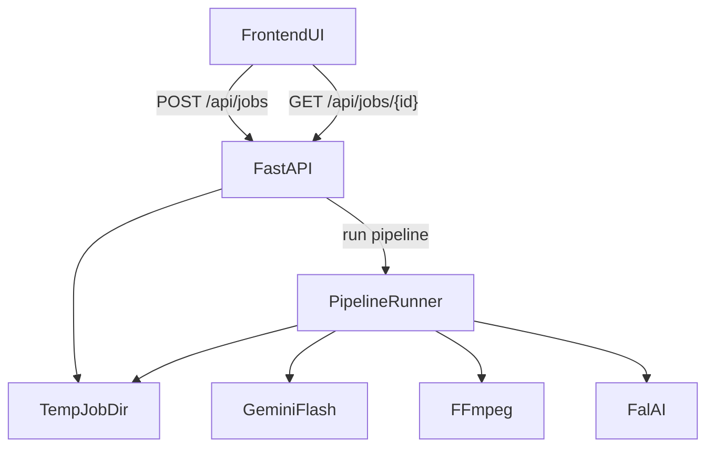

# Who's Clip Is It? — Project Overview

AI-powered brainrot reel generator for sports highlights. This document is the
single source of truth for system behavior, architecture, data flow, and
runtime config. It is designed to be LLM-readable.

## Summary
- Input: MP4 upload (<100MB).
- Output: 2–5 ready-to-post 9:16 reels.
- Core flow: upload → Gemini video analysis → clip timestamps →
  FFmpeg asset extraction → deterministic format selection →
  Fal AI generation → FFmpeg postprocess → outputs.
- Demo scope: local-only backend, no auth, no rate limiting, no >100MB.

## Repo layout
```
/
├── frontend/                 # Next.js UI
├── backend/                  # FastAPI + pipeline modules
│   └── requirements.txt      # backend Python dependencies
├── prompts/                  # prompt templates and format templates
├── assets/                   # placeholder SFX/music/images
├── temp/                     # local scratch for uploads/outputs (gitignored)
├── README.md
└── project.md                # this document
```

## Architecture
### High-level flow
1. User uploads MP4 via frontend.
2. Backend creates async job + writes `temp/jobs/<job_id>/job.json`.
3. Backend pipeline:
   - Gemini analyzes video natively and returns 2–5 clip moments.
   - FFmpeg extracts assets per clip (frame, audio, optional clip).
   - Deterministic mapping selects one of 15 formats.
   - Fal AI generates a reel per clip (model by format).
   - FFmpeg postprocess: 9:16, overlays, SFX/music, captions (optional).
4. Frontend polls job status and renders results.

### Data flow diagram (mermaid)


## Backend
### Runtime
- FastAPI app with async job orchestration.
- Job state persisted on disk under `temp/jobs/<job_id>/`.

### Endpoints
- `POST /api/jobs`
  - multipart form-data: `file` (MP4)
  - validates size/type
  - saves `temp/jobs/<job_id>/input.mp4`
  - enqueues background pipeline task
  - returns `{ "job_id": "..." }`
- `GET /api/jobs/{job_id}`
  - returns job status, stage, progress, clips, outputs
- `GET /api/jobs/{job_id}/outputs/{path}`
  - serves generated files from job directory
- `GET /health`

### Job state
`temp/jobs/<job_id>/` contains:
- `input.mp4`
- `job.json` (status, stage, progress, error)
- `analysis.json` (Gemini raw)
- `clips.json` (normalized)
- `assets/<clip_id>/frame.png`, `clip.mp4`, `audio.wav`
- `reels/<clip_id>/<format_id>/generated.mp4`
- `reels/<clip_id>/<format_id>/final.mp4`

### Status fields
- `status`: `queued | running | failed | complete`
- `stage`: `analyzing | extracting | selecting_formats | generating | postprocessing | done`
- `progress`: 0–100
- `message`: status text
- `clips`: array of clip objects (after analysis)
- `outputs`: array of reel objects with URLs

### Key modules (backend/)
- `main.py`: FastAPI app + routes.
- `config.py`: env vars, paths, constants; loads `.env`.
- `job_store.py`: job state read/write.
- `pipeline.py`: orchestrates stages and progress.
- `video_analysis.py`: Gemini analysis (native video + JSON schema).
- `clip_detection.py`: normalize timestamps to ms.
- `asset_extraction.py`: FFmpeg frame/clip/audio extraction.
- `format_selection.py`: deterministic mapping to 15 formats.
- `generation.py`: Fal calls with concurrency controls.
- `postprocessing.py`: 9:16 conversion + overlays.

### Gemini integration (video analysis)
- Uses `google-genai` SDK.
- Model: `GEMINI_MODEL` (default `gemini-3-flash-preview`).
- Reasoning: `GEMINI_REASONING` (default `medium` → `thinkingLevel`).
- Strict JSON: `response_mime_type=application/json` + JSON schema.
- Retry: one repair prompt if JSON parse fails.
- File upload via Files API; waits for file to be ACTIVE.

### Clip schema (normalized)
Each clip object:
```
{
  "start_ms": int,
  "peak_ms": int,
  "end_ms": int,
  "type": "big_play|fail|reaction|controversial|clutch|funny",
  "description": string,
  "players": string[],
  "context": string,
  "announcer_energy": 1..10,
  "crowd_energy": 1..10
}
```

## Frontend
### Pages
- `/` upload page
  - validates MP4 + size <100MB
  - submit -> creates job -> redirect to `/jobs/[jobId]`
- `/jobs/[jobId]`
  - polling status
  - shows progress and results

### Demo mode (frontend)
- `NEXT_PUBLIC_DEMO_MODE=1` loads `frontend/public/demo/results.json`.

## Formats (15)
Defined in `prompts/formats.json`. Each format has:
`id`, `name`, `input_mode`, `model`, `length_s`, `prompt_template`,
`requires_assets?`.

## Deterministic format selection
Current mapping uses `clip.type` and energy to pick a single format ID per clip.
This is implemented in `backend/format_selection.py`.

## Post-processing
FFmpeg is used to:
- normalize output codecs,
- convert to 9:16,
- optionally layer SFX/music,
- captions are optional for MVP.

## Environment variables
Backend (`.env`):
- `GEMINI_API_KEY` (required for real analysis)
- `GEMINI_MODEL` (default `gemini-3-flash-preview`)
- `GEMINI_REASONING` (default `medium`)
- `FAL_KEY` (required for real generation)
- `FFMPEG_PATH` (default `ffmpeg`)
- `FFPROBE_PATH` (default `ffprobe`)
- `DEMO_MODE=1` (bypass real pipeline)

Frontend (`.env.local`):
- `NEXT_PUBLIC_API_BASE_URL` (default `http://localhost:8000`)
- `NEXT_PUBLIC_DEMO_MODE=1`

## Constraints / scope limits
- MP4 only
- <100MB only
- No auth or rate limiting
- Local filesystem for storage
- Demo mode uses precomputed outputs

## Running locally (short)
- Frontend: `cd frontend && npm run dev`
- Backend:
  - `cd backend && python3 -m venv .venv && . .venv/bin/activate`
  - `pip install -r requirements.txt`
  - optional: `pip install -e .`
  - `uvicorn main:app --reload --host 0.0.0.0 --port 8000`
